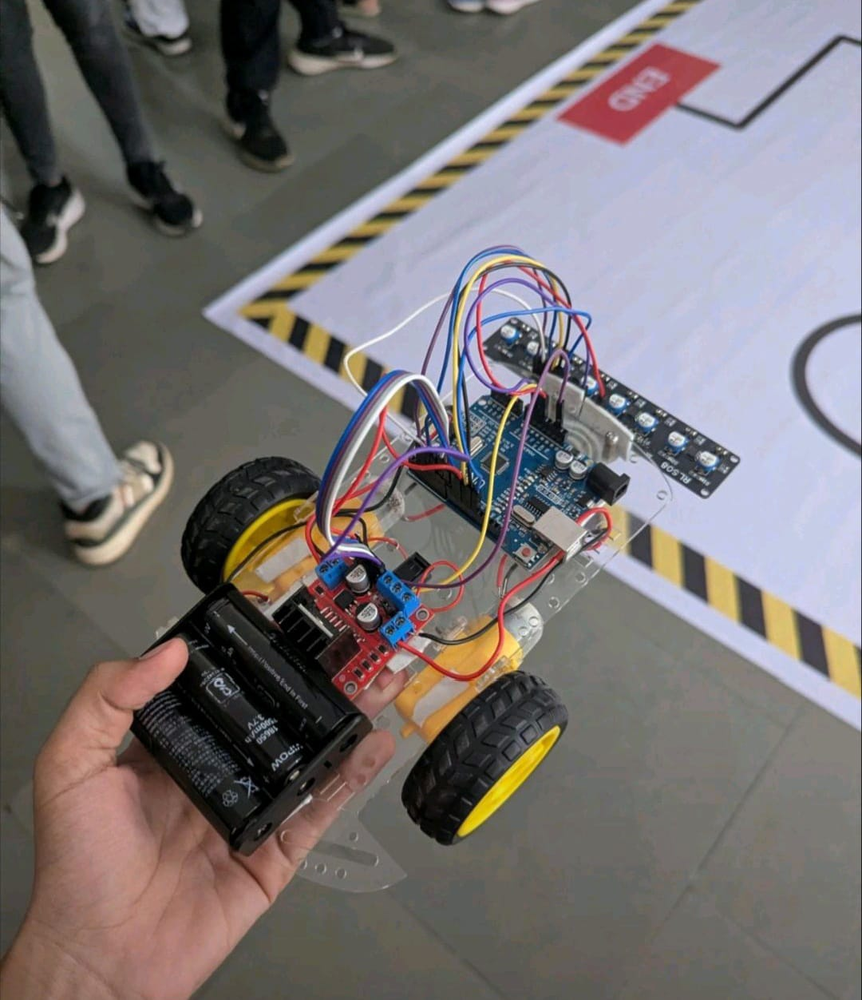
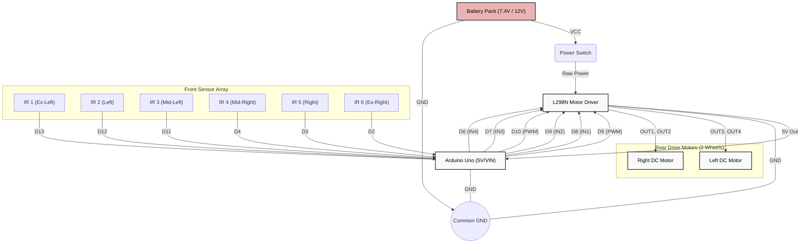

# PathFinder-Bot 🤖🏎️


**PathFinder-Bot** is an autonomous, high-speed line-tracking robot. It leverages a 6-sensor IR array in tandem with **PID (Proportional, Integral, Derivative) Control logic** to ensure smooth and accurate line tracking over complex paths. 

<div align="center">
  
  <br/>
  <em>The PathFinder Robot</em>
</div>

---

## 🎥 Bot in Action
Watch the bot seamlessly navigate the track!


<div align="center">
  <video src="assets/bot_demo.mp4" width="600" controls>
    <a href="assets/bot_demo.mp4">Download/Play Video</a>
  </video>
</div>

---

## 🛠️ Tech Stack & Components
To build this robot, the following components were utilized:
- **Microcontroller:** Arduino Uno
- **Sensor Array:** 8-Channel IR Sensor Array (6 sensors utilized for precise PID logic)
- **Motor Driver:** L298N Dual H-Bridge Motor Driver
- **Actuators:** 2x DC Gear Motors
- **Power Supply:** Li-ion Battery configuration
- **Chassis:** Custom Robot Chassis with Caster Wheel
- **Language:** C/C++ (Arduino IDE)

---

## 🧠 Features & Capabilities
1. **PID Control System:** Calculates proportional, integral, and derivative errors continuously for smooth turning, eliminating "wobbly" movements.
2. **Junction Detection:** Capable of recognizing and responding to grid line intersections or sharp angles.
3. **Responsive Autonomy:** High polling rate on the IR sensors allows the robot to handle high-speed straight lines and tight curves.

---

## 🔌 Circuit & Wiring (Pin Configuration)

### 🤖 Robot Chassis Layout
The robot uses a **differential drive 3-wheel configuration**:
- **Front:** 1x Free-turning 360° Caster Wheel (Maintains balance and allows sharp turns).
- **Rear:** 2x Drive Wheels (Left & Right), each connected individually to a DC Gear Motor.

### 🔗 Connection Diagram




### Motor Driver (L298N)
| Arduino Pin | Motor Driver Pin | Purpose |
| ----------- | ---------------- | ------- |
| `D5` (PWM)  | ENA              | Right Motor Speed |
| `D8`        | IN1              | Right Motor Direction |
| `D9`        | IN2              | Right Motor Direction |
| `D10` (PWM) | ENB              | Left Motor Speed |
| `D7`        | IN3              | Left Motor Direction |
| `D6`        | IN4              | Left Motor Direction |

### IR Sensor Array
| Arduino Pin | Sensor Position |
| ----------- | --------------- |
| `D13`       | Ex-Left (1)     |
| `D12`       | Left (2)        |
| `D11`       | Mid-Left (3)    |
| `D4`        | Mid-Right (4)   |
| `D3`        | Right (5)       |
| `D2`        | Ex-Right (6)    |

---

## 🚀 How to Run

1. **Clone the repository:**
   ```bash
   git clone https://github.com/fenilfinava/PathFinder-Bot.git
   cd PathFinder-Bot
   ```
2. **Setup Hardware:** Assemble the components according to the wiring table above.
3. **Open the code:** Open `src/line_follower.ino` using the Arduino IDE. 
4. **Tune PID Values:** The default `Kp`, `Ki`, and `Kd` values may need to be adjusted based on your robot's weight, battery voltage, and track properties. Change them at the top of the file:
   ```cpp
   float Kp = 4.0;
   float Ki = 0.001;
   float Kd = 2.0;
   ```
5. **Upload & Test:** Select your Arduino Uno board and COM port, then hit Upload. Place the robot on a test track and watch it go!

---

## 👨‍💻 Author
**Fenil Finava**
*Computer Engineering Student | Tech Enthusiast*
